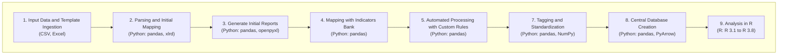
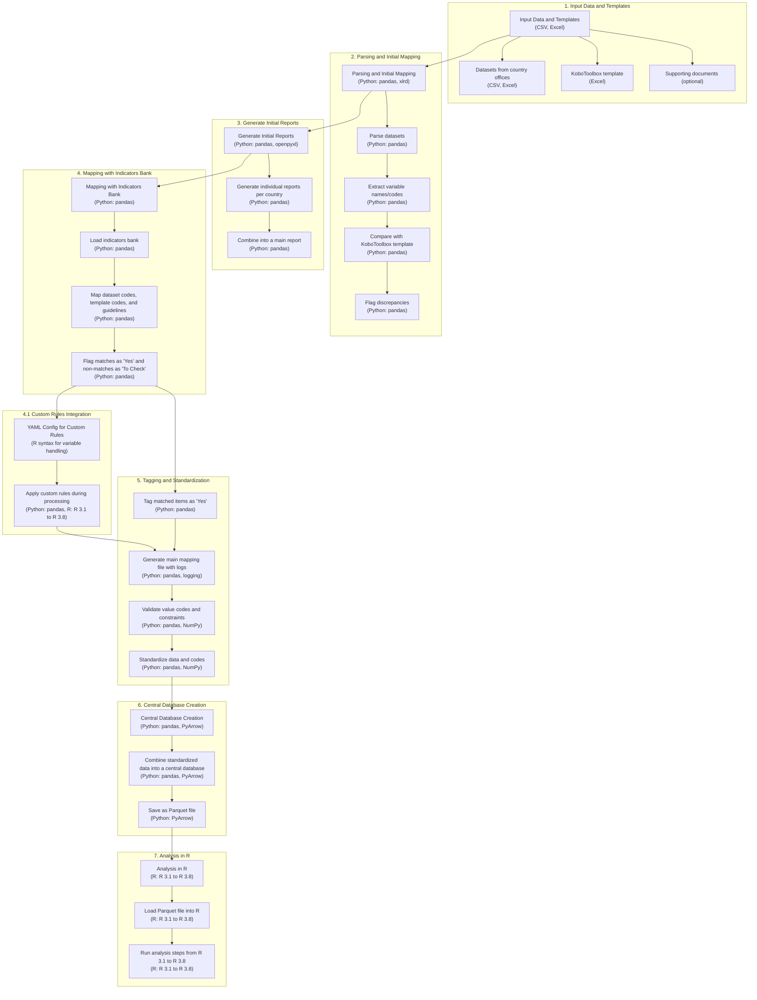

# Pipeline for Dataset Standardization and Mapping with Customizable Rules and Functions

## Overview

The pipeline aims to standardize datasets from country offices using a KoboToolbox template, with the ability for end users to define custom rules and functions in YAML or similar config files using R syntax. This customization helps handle variables that cannot be matched directly, ensuring flexibility and automation in data processing.

### Steps in the Pipeline



1. **Input Data and Template Ingestion**:
    - Accept datasets from country offices.
    - Accept KoboToolbox template and supporting documentation as optional inputs.

2. **Parsing and Initial Mapping**:
    - Parse the datasets and extract variable names/codes.
    - Compare and map these variable names/codes to the KoboToolbox template.
    - Flag any discrepancies between the datasets and the template.

3. **Generate Initial Reports**:
    - Generate individual reports for each country's dataset highlighting discrepancies.
    - Combine these individual reports into a main report.

4. **Mapping with Indicators Bank**:
    - Map the dataset codes, template codes, and guidelines with the indicators bank.
    - Flag the matches as "Yes" and the non-matches as "To Check".
    - Discuss "To Check" items within the team to decide on the pseudocode needed to process and clean them for reuse.

5. **Customizable Rules and Functions**:

    - YAML Configuration:
        - End users define custom rules and functions using YAML or similar config files.
        - Rules and functions are written in R syntax for flexibility.
        - Example rule: If variable X does not match, apply function Y to clean or transform it.

6. **Automated Processing with Custom Rules**:

    - Implement automated processing using defined rules and functions:
        - Apply custom rules to handle variables that cannot be directly matched.
        - Automatically execute functions specified in the YAML config for data cleaning and transformation.

7. **Tagging and Standardization**:
    - Tag all matched items as "Yes" for further use.
    - Generate a main mapping file containing all the information and transformation logs.
    - Check the value codes and flag any discrepancies, including constraint logics.
    - If all checks are good, standardize the data and codes following the guideline code and the main mapping sheet.

8. **Central Database Creation**:
    - Combine all standardized data into one central database, saved as a Parquet file for efficient analysis.

9. **Analysis in R**:
    - Load the Parquet file into R.
    - Run analysis steps from R 3.1 to R 3.8 if everything is standardized and agreed upon.

### Detailed Implementation Plan

#### 1. Input Data and Template Ingestion

- **Tools**: Python (Pandas, PyArrow), KoboToolbox API
- **Steps**:
    1. Read datasets from country offices (CSV, Excel, etc.).
    2. Read KoboToolbox template and supporting documents if provided.

#### 2. Parsing and Initial Mapping

- **Tools**: Python (Pandas, Regex)
- **Steps**:
    1. Parse variable names and codes from datasets.
    2. Compare and map to the KoboToolbox template.
    3. Flag discrepancies and log them.

#### 3. Generate Initial Reports

- **Tools**: Python (Pandas, ReportLab or any reporting library)
- **Steps**:
    1. Generate individual discrepancy reports for each country.
    2. Combine into a main report.

#### 4. Mapping with Indicators Bank

- **Tools**: Python (Pandas), SQL Database
- **Steps**:
    1. Load indicators bank.
    2. Map dataset codes, template codes, and guidelines.
    3. Flag matches and non-matches.
    4. Discuss and finalize pseudocode for non-matches.

#### 5. Customizable Rules and Functions

- **Tools**: Python (Pandas, YAML)
- **Steps**:
    1. End users define rules and functions in YAML config files using R syntax.
    Example YAML config:

        ```yaml
        rules:
          - variable: X
            condition: "X != 'expected_value'"
            action: "Y <- function_to_handle(X)"
        ```

    2. Integrate YAML config into pipeline to automate processing.

#### 6. Automated Processing with Custom Rules

- **Tools**: Python (Pandas, R via rpy2)
- **Steps**:

    1. Implement automated processing using defined rules and functions:
    2. Evaluate conditions specified in YAML for each dataset.
    3. Apply corresponding actions using R functions where conditions are met.

#### 7. Tagging and Standardization

- **Tools**: Python (Pandas)
- **Steps**:
  1. Tag matched items.
  2. Generate main mapping file with logs.
  3. Validate value codes and constraints.
  4. Standardize data and codes.

#### 8. Central Database Creation

- **Tools**: Python (Pandas, PyArrow)
- **Steps**:
  1. Combine standardized data.
  2. Save as a Parquet file.

#### 9. Analysis in R

- **Tools**: R, R Libraries (dplyr, ggplot2, etc.)
- **Steps**:
  1. Load Parquet file in R.
  2. Run analysis steps from R 3.1 to 3.8.

### Visual Diagram


